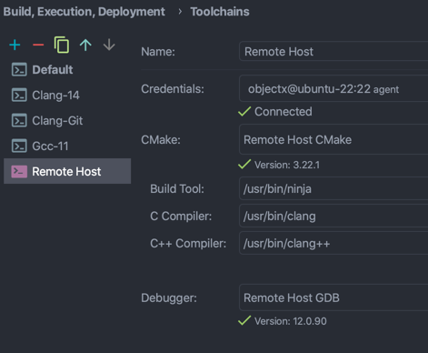
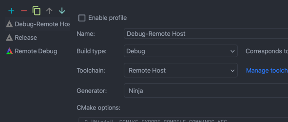

# CLion Remote toolchain bug example

Creates a remote toolchain configuration like following



Then use it



CLion says following:

```text
/usr/bin/cmake -DCMAKE_BUILD_TYPE=Debug -DCMAKE_MAKE_PROGRAM=/usr/bin/ninja -DCMAKE_C_COMPILER=/usr/bin/clang -DCMAKE_CXX_COMPILER=/usr/bin/clang++ -G Ninja -DCMAKE_EXPORT_COMPILE_COMMANDS=YES -S /tmp/tmp.tHOesoWHE0 -B /tmp/tmp.tHOesoWHE0/00.B/remote-debug
-- The C compiler identification is Clang 14.0.0
-- The CXX compiler identification is Clang 14.0.0
-- Detecting C compiler ABI info
-- Detecting C compiler ABI info - done
-- Check for working C compiler: /usr/bin/clang - skipped
-- Detecting C compile features
-- Detecting C compile features - done
-- Detecting CXX compiler ABI info
-- Detecting CXX compiler ABI info - done
-- Check for working CXX compiler: /usr/bin/clang++ - skipped
-- Detecting CXX compile features
-- Detecting CXX compile features - done
-- Configuring done
-- Generating done
-- Build files have been written to: /tmp/tmp.tHOesoWHE0/00.B/remote-debug
CMake File API: /Users/objectx/Workspace/GitHub/CPP-30230/00.B/remote-debug: no reply dir found

Cannot get compiler information:
	Compiler exited with error code 127: /Applications/Xcode.app/Contents/Developer/Toolchains/XcodeDefault.xctoolchain/usr/bin/c++ -xc++ -g -isysroot /Applications/Xcode.app/Contents/Developer/Platforms/MacOSX.platform/Developer/SDKs/MacOSX11.1.sdk -mmacosx-version-min=10.15 -fcolor-diagnostics -fpch-preprocess -v -dD -E
	env: ‘/Applications/Xcode.app/Contents/Developer/Toolchains/XcodeDefault.xctoolchain/usr/bin/c++’: No such file or directory
	
	

[Failed to reload]
```

Transfer log is:

```text
[2022/08/22 20:53] Download '/tmp/tmp.tHOesoWHE0/00.B/remote-debug/CMakeCache.txt' to '/Users/objectx/Workspace/GitHub/CPP-30230/00.B/remote-debug/CMakeCache.txt' using rsync
[2022/08/22 20:53] /usr/local/bin/rsync -zar -e "ssh -p 22 " --exclude=.svn --exclude=.cvs --exclude=.idea --exclude=.DS_Store --exclude=.git --exclude=.hg --exclude=*.hprof --exclude=*.pyc objectx@ubuntu-22:/tmp/tmp.tHOesoWHE0/00.B/remote-debug/CMakeCache.txt CMakeCache.txt
[2022/08/22 20:53] Download from Remote Host (6e38a719-8d27-40d6-839d-a2e86ce1b089) completed in 88 ms: 1 item transferred
```

Missing transferring `.cmake/` directory.
